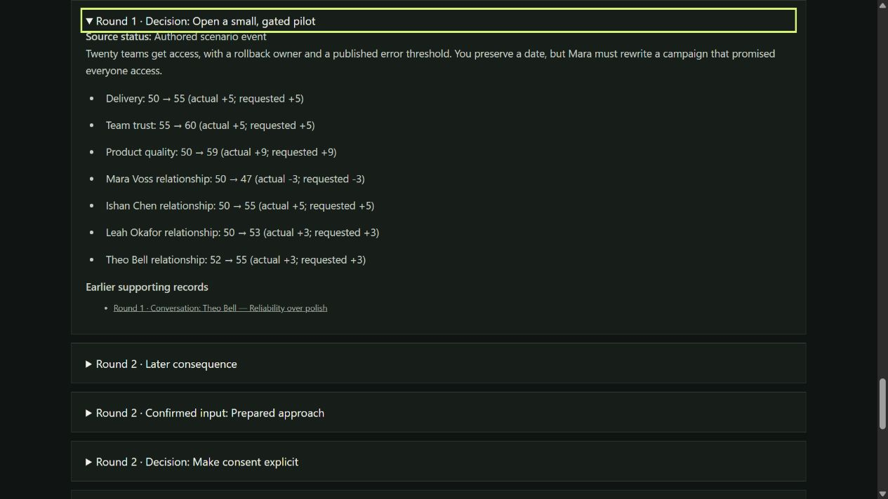

# SCRUM-16 fresh setup and keyboard journey

Coordinator/root authored this execution record; QA, Development and Product/UIUX independently review it. Tracked work: [SCRUM-16](https://sadhirr1.atlassian.net/browse/SCRUM-16), coordination [SCRUM-18](https://sadhirr1.atlassian.net/browse/SCRUM-18). The filename identifies the 11:00 scheduled slot. The owner requested continuation, and actual resumed checks took place after noon October 3, 2026, America/Los_Angeles. No continuous work-hour claim is made.

## Candidate and fresh setup

Application candidate: `387d6fbab5d86871912cf2f1f12378f8ddabd41c`, draft [PR #8](https://github.com/sadhirr1/Stakewolf/pull/8). Root prepared a genuine local Git clone with `git clone --no-hardlinks . .cache/fresh-SCRUM-16-387d6fb`. Existing destination was checked absent before cloning. QA independently verified its clean status, commit and README prerequisites, then executed the four documented syntax checks and **99/99 tests**, no failures/skips/cancellations, at **12:15:18 PDT**, 1219.9596 ms. See the [QA record](session-2026-10-03-1100-qa.md) for exact bytes/environment. This local clone is a fresh checkout, not a new operating system or second computer.

Root started `node server.mjs 4175` from that fresh checkout; it printed `http://127.0.0.1:4175`. All browser checks below used that address in a newly created Codex In-app Browser tab, Windows, viewport **1280 × 720**. Browser version is not exposed by the tool. Server session `87154` belonged to this run. No application/test files changed; the committed app's two normalized line endings differ from the earlier working-tree hash, as independently established in QA's record.

## Actual keyboard-only execution

The initial focused element was the browser document. All actions used native `tab.pressKey(null, key)` or `tab.typeText(null, text)`: **null means the currently focused element**. Each action was followed by observed accessibility state. Read-only DOM inspection supported focused-element checks. No pointer action, locator-directed focus/activation, scripted focus, engine call or game-tool mutation reached a control or advanced play.

The [retained key and focus trail](keyboard-trail-2026-10-03-1100.json) preserves each journey action and its resulting accessibility state. Repeated Tab traversal to Download was bounded and checked the actual focused element after each step. This evidence establishes one complete keyboard path, not every interaction variant.

| Segment | Actual result |
| --- | --- |
| Start/skip/workspace | Tab reached Skip; Enter focused main. Tab reached Enter the launch room; Enter started R1 and focused its heading. Tab reached the selected workspace tab. Right, End and Home activated Evidence, Decision record and Your decision with corresponding tab focus. |
| Stakeholders | Shift+Tab reached sidebar Restart, then Theo. Enter opened Theo with Close focused; Tab/Enter asked `atlas-need` (What do customers need first?). The reply showed Reliability over polish; one conversation remained, Close regained focus after redraw. Escape returned to the new Theo control. Shift+Tab/Enter/Escape opened and closed Leah, Ishan and Mara in order, with correct opener return. No additional questions were asked. |
| Help | From Mara, Shift+Tab reached How to play. Enter opened Help with Close focused. Shift+Tab reached the dialog container, Tab returned to Close, Escape closed it and returned to How to play. This tests that specific native-dialog route, not all possible wrap sequences. |
| Prepared selection | Forward Tab reached workspace, panel and pilot. Space selected pilot; Tab/Space selected launch instead. Selection stayed in R1 without committing. Continued Tab reached Write your own decision. |
| Typed validation/fallback | Enter focused textarea. Tab/Enter on Review with empty input returned focus to textarea, with the at-least-20-character message. Current-focus typing entered exactly `I will not run a small pilot this week.` (39 code units). Tab/Enter opened an unselected conservative fallback. Tab/Enter attempted confirmation without a choice; first radio regained focus and the choose-an-approach feedback appeared, with no decision. Tab/Tab/Enter reached Edit; the draft was intact and textarea focused. |
| Home cancellation | Reverse Tab navigation passed Help; Enter briefly reopened Help, Escape returned, then Shift+Tab reached Home. Enter opened Leave this attempt with Keep playing focused. Enter cancelled; Home regained focus. Forward Tab returned to Review through the intact 39-unit draft; Theo evidence and 50/55/50 metrics were retained. This check covers Home cancellation, not every restart trigger. |
| Typed confirmation | Enter opened fallback again. Space explicitly selected pilot; Tab/Enter confirmed it. Result heading focused, original wording was separately labelled from the confirmed pilot, metrics 55/60/59. |
| Rounds 2–5 | Tab/Enter continued each result. Heading → Tab selected workspace tab → Tab panel → Tab first approach. Space selected it, four Tabs reached Commit, Enter applied it. Choices were explicit consent, open correction, shared core, bounded recommendation. The same keyboard pattern completed all rounds without assistance. |
| Debrief/source | Enter on Open your debrief focused You earned the next step. Final D/T/Q **41/100/100**, one conversation, one stakeholder, zero evidence bonuses. Tab/Enter expanded Supporting records (10); Tab/Enter followed R1 Decision: Open a small, gated pilot. Source `debrief-source-2` opened and its summary focused, with computed solid 2.66667px outline. |
| Download/replay | Nineteen observed Shift+Tab steps from that summary reached Download decision record. Enter requested download; warning/error logs were empty. A delivery wait started before activation timed out after 15 seconds with no file path. Shift+Tab reached Play another attempt; Enter returned to the clean intro with Enter the launch room focused and the progress-not-saved notice visible. |

Product independently calculated the choice arithmetic from authored rules; see the [review record](session-2026-10-03-1100-review.md). The confirmed typed choice drives the pilot consequences even though the preserved negated wording differs. The debrief describes the confirmed approach explicitly. Identical final metrics to another fixture do not imply identical histories: this run has only one question and zero bonuses.

This capture demonstrates the R1 source expanded and focused. It does not alone establish the preceding traversal; the key/focus trail supplies that evidence.

## Remaining gates and limitations

**Passed for this bounded path:** documented fresh checkout syntax/tests, starting that checkout's local server, executing a full five-round browser playthrough against it, and completing that playthrough using current-focus keyboard navigation. Development owned the combined source integration; root executed this browser path, and Development, QA and Product independently review the evidence. Root authored earlier application patches, so this does not claim an entirely separate author-free browser tester across the application's history. QA independently executed the fresh automated checks; a second independent browser execution remains useful for final acceptance. This is a bounded QA-AC-13 setup/playthrough result and keyboard path, not complete AC-07 or release acceptance.

**Actual 200% zoom remains unverified.** Available browser inventory exposed only In-app Browser and MCP Apps. In-app Browser advertises viewport/visibility, not a verified zoom control. A native Ctrl+plus check after replay left observed viewport 1280×720, device-pixel ratio 1.5 and visualViewport scale 1 unchanged. Ctrl+0 left those observations unchanged. No 200% setting was established or tested; device-pixel ratio and resizing are not substitute proof. Next owner: UI/UX/QA, using a browser surface that exposes verifiable zoom.

**Actual downloaded-file delivery remains unverified.** The request was exercised, but the 15-second tool wait produced no file. No warning/error log was recorded. This is a concrete verification limitation, not proof of a broken game export. Next owner: QA/Coordination, obtain a supported browser/download surface and inspect delivered content. Formatter correctness has separate automated evidence.

Remaining broader checks include screen reader/device/cross-browser coverage, additional dialog/exhausted-conversation variants, representative player feedback where available, and acceptance of all required criteria. No additional feature, test or source correction was authored during this increment. PR #8 remains a proposal, not a released/deployed game. Earlier automatic approval review rejected merging without explicit owner authorization; that authorization remains pending. Hosting/access is still unresolved for public deployment.

## Independent review and handoff

Product/UIUX (`product_plan`), QA (`agile_quality`) and Development (`delivery_review`) independently inspected all 151 retained action/focus entries, the source capture and this record. No observed gameplay blocker was found. Their common attribution finding was resolved by explicitly recording root's historical application contributions and separating current source integration, automated execution and browser evidence review. Product's incorrect rubric threshold was challenged and corrected before publication; it required no application fix. Coordinator separately reviewed the QA record and Product's corrected arithmetic/limits. README and current quality status describe bounded results without closing the remaining gates.

Cleanup: root stopped its own server session `87154` with Ctrl+C; the process completed (exit 1 from interruption). Temporary browser tab 2 was closed. No viewport override was introduced. The fresh clone is preserved in ignored `.cache/` for reproducibility; it is not itself the durable evidence. Other processes and user tabs were untouched.

All worker deliverables are frozen after final cross-review, with ownership released at publication. Root owns this record and cannot self-approve it. Existing main and PR #5/#6/#7 are preserved. Durable evidence is committed with the reviewed checkpoint. Next session: reconcile active work, obtain verifiable browser zoom/download capability, and assign a separate browser executor for broader acceptance. This candidate has no release or deployment claim.
