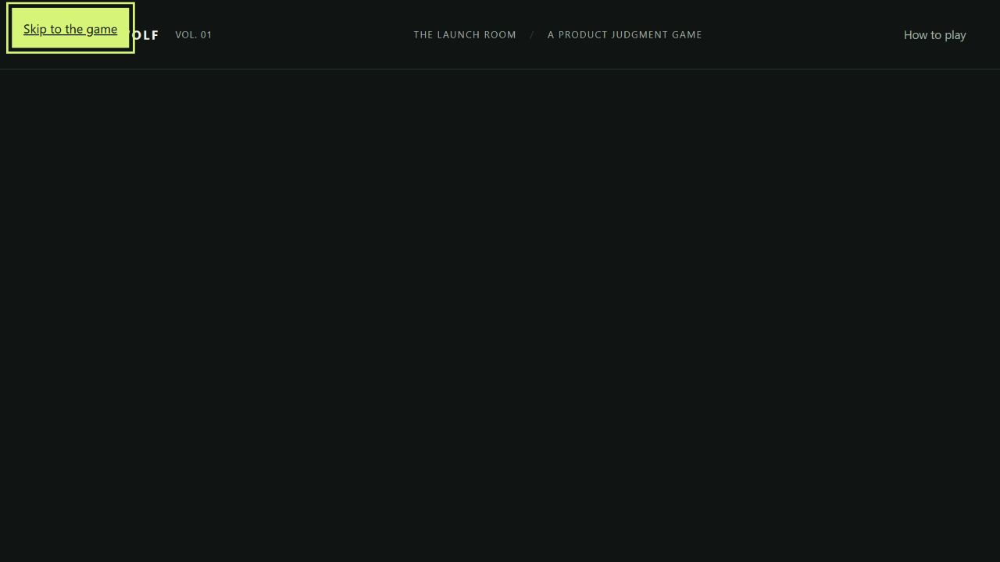
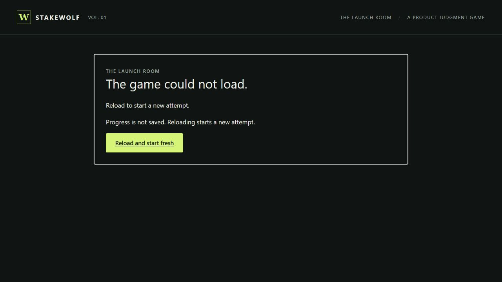

# October 3 13:00 session — startup recovery

Tracked by [SCRUM-12](https://sadhirr1.atlassian.net/browse/SCRUM-12), [SCRUM-16](https://sadhirr1.atlassian.net/browse/SCRUM-16), [SCRUM-17](https://sadhirr1.atlassian.net/browse/SCRUM-17) and [SCRUM-18](https://sadhirr1.atlassian.net/browse/SCRUM-18). Coordination owns this record; Development owns the startup fix, QA owns the tests, and Product/UIUX reviews the player-facing contract. No author approves their own deliverable.

## Reconciled baseline and failing reproduction

The checkout started clean at `0c99872c3e3dd0c649c05572e3bce209b32140b3`, on `feature/SCRUM-16-combined-candidate`. Draft PR #8 was open and unmerged; the current Jira handoff was SCRUM-18 comment 10103. The active-chat inventory showed no competing loaded writer in this checkout. SCRUM-18 comment 10105 reserves disjoint source, test, documentation and browser ownership for this session.

Before source edits, Coordination copied the frozen server and public assets into the ignored `.cache/startup-baseline-1300` fixture, deliberately omitting `app.js`. The server bound only to `127.0.0.1:4175`. No production file was renamed or removed. In the in-app Chromium browser at approximately **13:07 PDT**, the loaded page showed only the header and How to play button. Read-only DOM inspection found an empty `#app` and **zero `#main` targets**; there was no recovery message or link. Native current-focus Tab then Enter activated Skip to the game but retained focus on the skip link with a nonexistent `#main` destination. The captured console tool returned no entries; this is not a claim of no underlying network error.

QA proposed **S2, acceptance-blocking**: the controlled initial-asset recovery case violates the required startup feedback/keyboard contract (UX-V10, QA-AC-04, AC-01/07). Normal startup failure is not alleged. SCRUM-12 moved from In Review to In Progress; comment 10106 records the reproduction and assignment before implementation.

## Implementation and retest

Development added an external `bootstrap.js` that awaits application/module evaluation and checks that the usable intro was rendered. The original HTML now contains a focusable `#main`, native reload link, no-save consequence and `<noscript>` guidance before any module executes. Help is hidden until initialization succeeds. On import/evaluation failure the loader restores that original fallback even if initialization already replaced it. Normal startup does not move focus unless a removed fallback held focus. `app.js`, scenario, engine and styles are unchanged. The server allowlists only the additional bootstrap asset; CSP remains restrictive and unchanged. Package and CI commands include the new syntax check.

The tested working tree is based on `0c99872`; the [independent QA record](session-2026-10-03-1300-qa.md) retains exact SHA-256 identities. Bootstrap: `BB533070381442051771D0A96C161B411BE959E9A2B9223D82C4DDC69C4E654E`; HTML: `3C3D8DB0DB0749ED9D7C5E47A874655C3D569E28E074E86D9F2E45EE4CF303E1`; server: `36E942EE3D5E255CF1BA28CC4FAB08E1F2A0914C5700B417A71D1CAFE4D364AC`. The unchanged local `app.js` retains its historical CRLF hash; the committed bytes have the previously verified LF identity. That normalization does not alter gameplay.

At **13:10:02 PDT**, QA independently ran five syntax checks and **109/109 tests**, zero failures/skips/cancellations, **1198.0116 ms**, Node 24.19.0 on Windows. New cases execute real temporary ES modules for absent entry, missing dependency, invalid syntax, throwing and asynchronously rejecting initializers, successful awaited evaluation and a subsequent independently loaded successful module after a loader failure. That last case does not prove same-page recovery of a failed browser module cache. Served-byte/MIME/CSP and static recovery/no-script semantics are also checked. Development independently reviewed QA's tests. An apparent undefined-variable finding was withdrawn after exact source reinspection; no repair or failing test run is claimed. QA, Product and Coordination reviewed the fix; the author is not its sole reviewer.

Coordination then inspected five isolated fixture copies with native input and read-only DOM observations in the in-app Chromium browser, desktop **1280×720**. These are actual browser checks, independently reviewed by Product/QA, but root contributed earlier application patches and is not a separate full-browser executor. Around **13:11–13:13 PDT**:

| Fixture | Observed result |
| --- | --- |
| Missing `app.js`, port 4176 | Clear “The game could not load” message, fresh-reload/no-save guidance, one main, hidden Help and no Start. Native Tab/Enter skip focused main; next Tab focused Reload; Enter retried and removed the hash from the URL. Persistent omitted file correctly produced the failure again. |
| Missing `engine.js`, port 4177 | Transitive dependency failure produced the same usable error/reload fallback. |
| Partial initializer, port 4179 | A deliberately substituted fixture app replaced the main with an unusable Start control then threw. The original fallback was restored, exactly one main remained and the unusable Start disappeared. This is a controlled synthetic initializer, not an allegation that the normal game throws. |
| Missing `bootstrap.js`, port 4178 | The static not-started message, conditional retry guidance and native fresh-reload remained usable; native skip focused main. JavaScript was **enabled**, so this does not establish actual disabled-JavaScript rendering. |
| Normal source, port 4180 | Fallback removed, one main, usable Start, Help visible and initial focus left on body. Current-focus native Tab/Enter skip then Tab/Enter Start reached round one. Help opened and Escape returned focus to Help. A normal public-launch decision committed once, displaying 68/50/36; refresh returned to the clean intro/Start/no-save notice. No full five-round playthrough ran in this session. |

The initial choice locator attempt used the AX checkbox representation, but the DOM control is a button; it made no selection. After inspecting the DOM snapshot, the correctly grounded button locator selected/committed the decision. This tool-selection correction is not an application defect or a repeated successful submission.

Additional retained captures: [static fallback](images/session-2026-10-03-startup-static.jpg), [partial initializer recovery](images/session-2026-10-03-startup-partial-init.jpg), [normal intro after refresh](images/session-2026-10-03-startup-normal.jpg). The fixed screen was visually inspected: readable content, clear reload control and visible main focus outline. These images do not demonstrate 200% zoom or a physical phone.

## Handoff limits

The reviewed source and tests are committed as `22de1c4927d70054a1ce4ee7cffbeab4f34099de`. The final evidence/handoff publication identity and exact-head CI outcome belong in [PR #8](https://github.com/sadhirr1/Stakewolf/pull/8) and the latest [SCRUM-18 handoff](https://sadhirr1.atlassian.net/browse/SCRUM-18); consult those live records rather than inferring remote checks from this local record. A source commit existing locally is not evidence of GitHub delivery or remote checks.

All six session-owned fixture servers (4175–4180) were stopped, and both temporary browser tabs closed after capture. The ignored isolated fixtures remain reproducible local test material; the unrelated 4173 listener was untouched. No production source was removed or renamed.

This increment does not authorize merge or deployment. Actual 200% zoom, received-download verification, a separate full-browser executor and remaining acceptance variants require their own evidence. Earlier complete gameplay and fresh setup results remain historical and must not be relabelled as tests of changed startup assets. Measured test durations are evidence of those executions, not eight hours worked.

